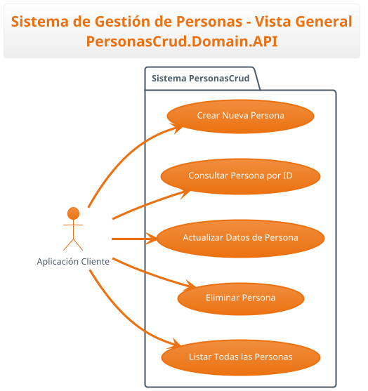
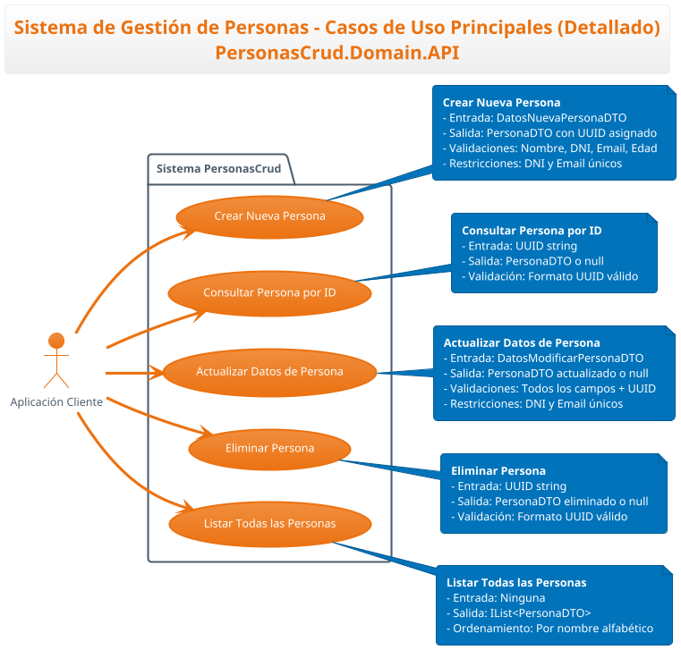
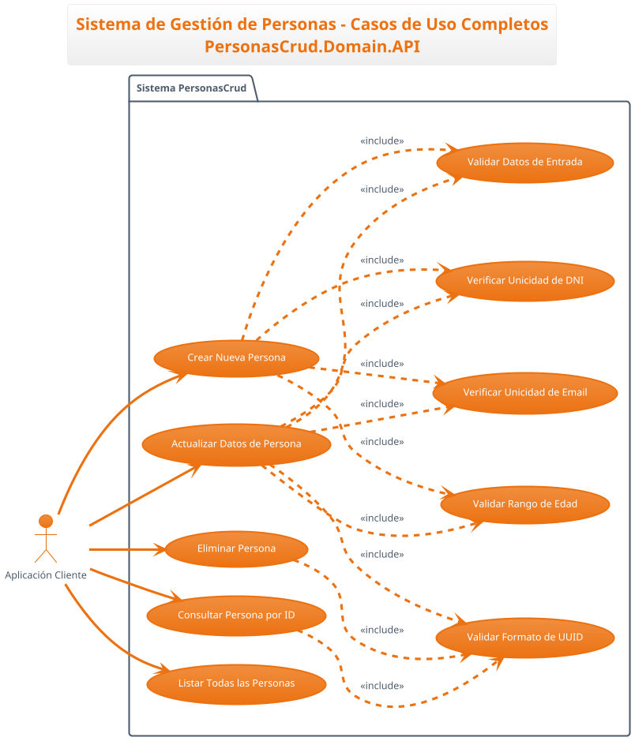
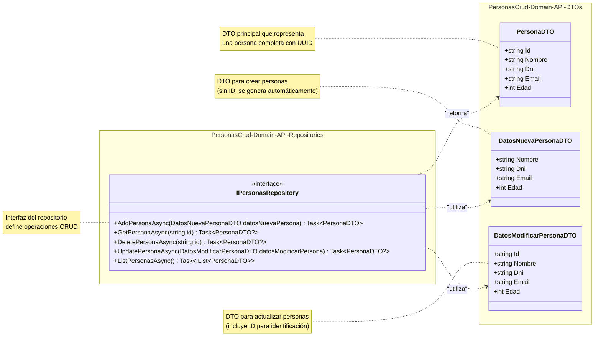
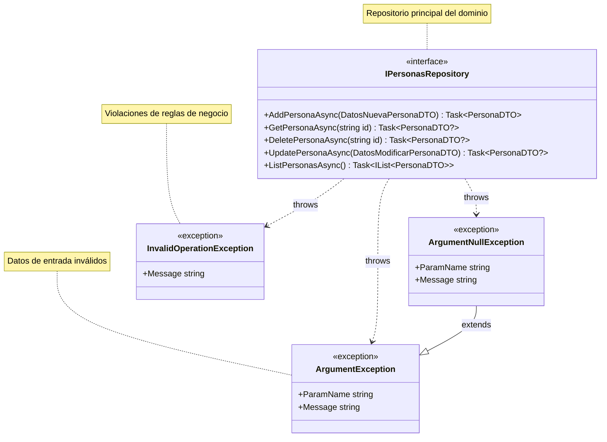

# Arquitectura - PersonasCrud.Domain.API

## 🏗️ Vista Arquitectónica del Dominio

Esta documentación describe la arquitectura y diseño del API de dominio para la gestión de personas, incluyendo casos de uso, modelo de datos y contratos de la interfaz.

## 📋 Casos de Uso

### Vista General

### Vista Detallada

### Vista Completa con Validaciones

## 📦 Modelo de Datos

### Diagrama de Clases - DTOs e Interfaz

### Diagrama de Excepciones

## 🎯 Principios Arquitectónicos

### Separación de Responsabilidades
- **API Layer**: Define contratos e interfaces
- **DTO Layer**: Objetos de transferencia optimizados
- **Repository Pattern**: Abstracción de persistencia

### Inversión de Dependencias
- Las capas superiores dependen de abstracciones
- No hay referencias a implementaciones concretas
- Facilita testing y intercambio de implementaciones

### Domain-Driven Design
- Enfoque en el dominio de negocio (Personas)
- Contratos claros y expresivos
- Validaciones de dominio explícitas

## 📝 Patrones Implementados

- **Repository Pattern**: `IPersonasRepository`
- **DTO Pattern**: Separación de objetos de entrada/salida
- **Fail Fast**: Validaciones tempranas con excepciones
- **Async/Await**: Operaciones no bloqueantes
