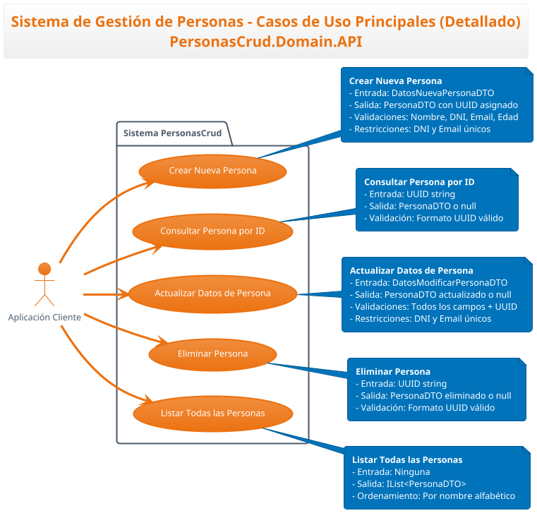
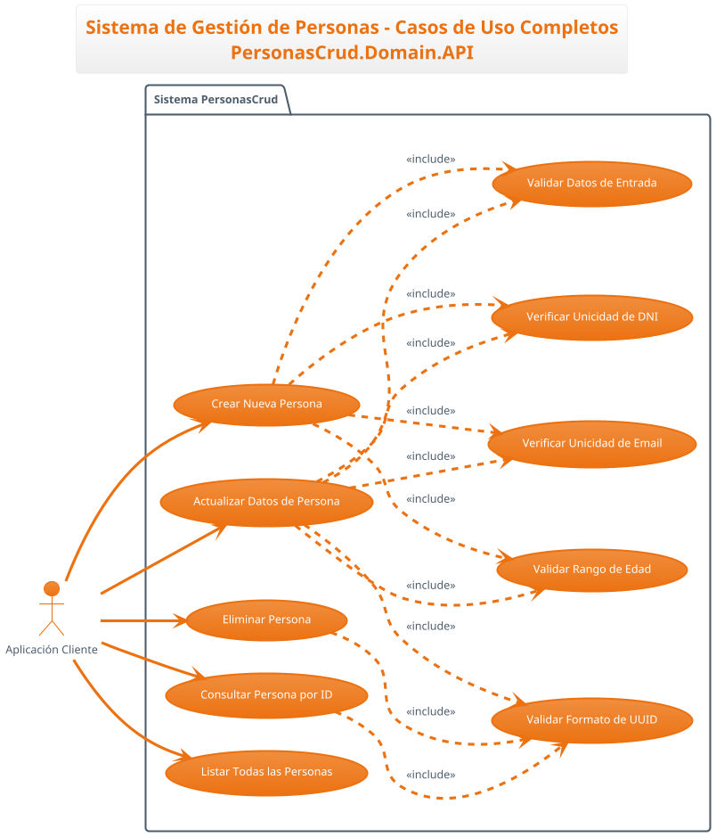
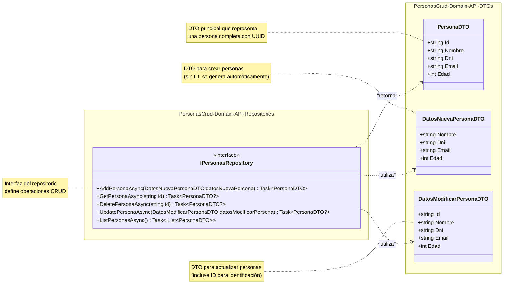
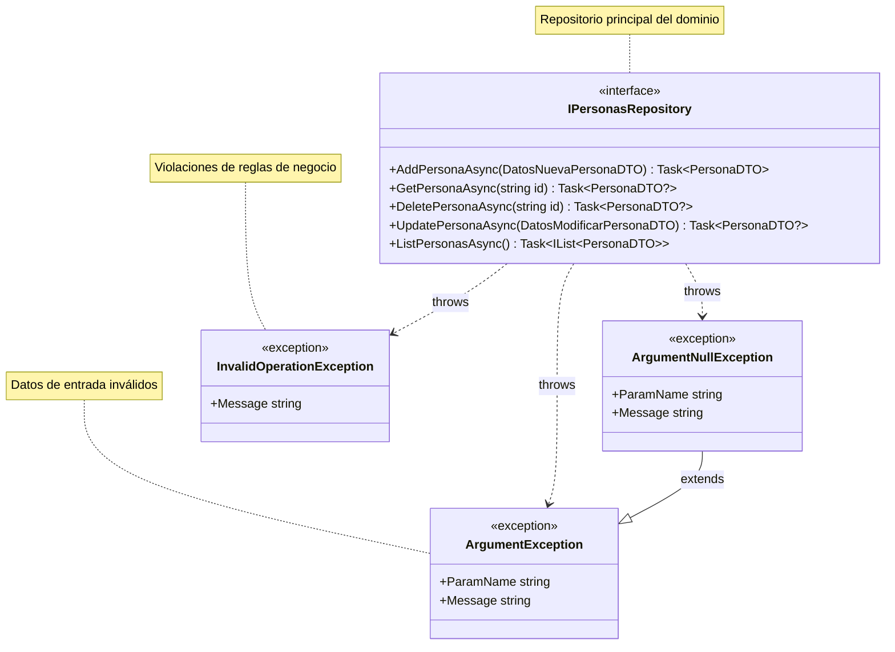

# Qué queremos generar?

- Objetivo... para qué sirve
- Casos de uso (UML<<- plantuml>>)-> Requisitos funcionales
- Arquitectura
  - Diagrama de paquetes/módulos <-- mermaid
  - Diagrama clases <-- mermaid
  - Diagrama de entidad - relación <-- mermaid
- Cómo le meto mano al proyecto:
  - Como lo compilo después de hacer cambios
  - Cómo lo pruebo después de hacer cambios
    - Si solo ejecutar un único fichero de test
  - Cómo generar la documentación de las clases (si aplica) / API C# (interfaces)
- Política en cuanto al trabajo con el repo (branches)
- Pruebas
  - Swagger iría en el controller REST 

Un buen sitio para meterlo, por lo menos muchas de estas cosas es un README.md

---
Qué hacemos:
1. Generamos diagrama de casos de uso (plantuml)

    > Necesito generar el diagrama de casos de uso en plantuml de el proyecto PrsonasCrud.Domain.API. Mételo en el chat

    > No va mal.. pero:
    El actor humano nos sobra... Nuestro api solo es consumido por una app cliente.

    En la leyenda, las validaciones no las metemos.. ya están en las notas. Las DTOs tampoco las queremos en este punto

    Generalo en vertical y no en horizontal:
    - Pon los actores a la izquierda
    - Pon los casos de uso a la derecha
    

2. Generamos diagrama de paquetes/módulos (mermaid)
3. Generamos diagrama de clases (mermaid)
 > VAmos a usar ahora mermaid para generar el diagrama de clases del proyecto PersonasCrud.Domain.API
 > Vamos a representar las dtos y la interfaz del repositorio

 > VAmos a usar ahora mermaid para generar otro diagrama de clases del proyecto PersonasCrud.Domain.API
 > Vamos a representar solamente la interfaz del repositorio y las excepciones que puede lanzar

4. Generamos diagrama de entidad-relación (mermaid)
5. Generamos documentación de la API C# (interfaces)
6. Integrarlo en un documento de arquitectura y documentación técnica (markdown)
  > GEnerame un archivo markdown con toda la documentación técnica del proyecto PersonasCrud.Domain.API, incluyendo estos diagramas que tengo en el archivo documentacion.md
  Añade el resto de información que consideres pertinente... y que aporte.. no rollo ni texto por engordar aquello innecesariamente
7. Crear el documento README.md con una intro al proyecto, las instrucciones de compilación, pruebas, generación de documentación y política de branches. Añade un enlace al documento de arquitectura y documentación técnica
  > GEnerame un archivo README.md con una intro al proyecto PersonasCrud.Domain.API, las instrucciones de compilación, pruebas, generación de documentación y política de branches. Añade un enlace al documento de arquitectura y documentación técnica que tenemos en documentacion.md

---

---

